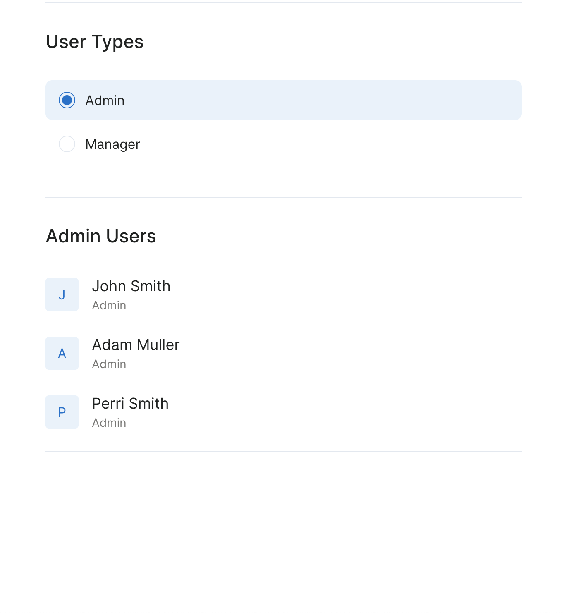

# Zeller QA Challenge
A Zeller frontend developer has just finished building a feature and has handed it over to yourself for testing. Your job is to evaluate the solution against the 'Jira' ticket that was provided, to write test cases for the feature and to write the cypress end to end tests that validate the feature. 

**Please provide back to Zeller**
- A document with your written test scenarios 
- A link or zip to a cloned copy of the zeller-qa-challenge with your cypress tests included in cypress/integration/e2e.ts. Note that an example cypress test is written in e2e.ts and cypress is runnable using the yarn commands detailed below in *Setup Guidelines*

# Ticket Description
As a user I want to view a list of users filtered by their Role type. 

**Acceptance criteria**
- The design should match the following provided image  
  
- The role types that a user can be filtered by are 'Admin' and 'Manager'. 
- The feature should include unit tests

## Setup Guidelines

The solution has been deployed to a test environment at [https://zeller-qa-challenge.netlify.app/](https://zeller-qa-challenge.netlify.app/)

To run in development mode run `yarn start`. Open
[http://localhost:3000](http://localhost:3000) to view it in the browser.

The tests for this project are broken out into unit and system tests, in order
to run these please see the commands below:

* Unit tests: `yarn test`
* Unit tests (with coverage): `yarn test --watchAll=false --coverage`
* System tests:  `yarn test:cypress`
* Typechecking: `yarn tsc --noEmit`

Note when running system tests ensure local application is running.
